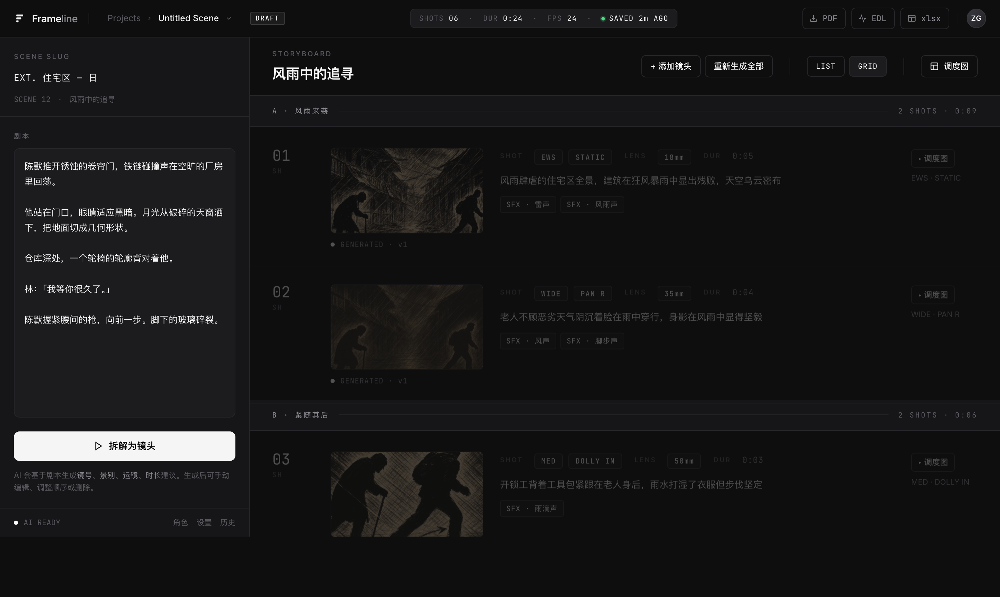
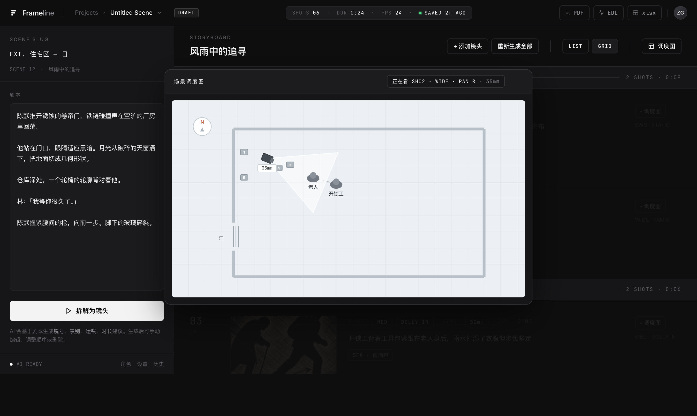

# Frameline

English | [简体中文](README.zh-CN.md)

**An AI storyboard tool for film & ad professionals.**
Paste a scene's script → AI breaks it into a real shot table (shot size, camera move, lens, axis, blocking) → generates black‑and‑white hand‑drawn cinematic boards → export to PDF, an Excel call sheet, EDL or FCPXML.

Not "one pretty frame from a prompt" — a whole scene's shootable storyboard, at scene granularity, that drops into a real production & editing pipeline.



---

## Features

- **Scene‑granular breakdown** — paste a whole scene, the AI returns a shot list (number / size / move / lens / duration / description / dialogue / SFX), editable.
- **Real shot table** — industry‑standard notation, not just images.
- **Hand‑drawn B/W boards** — each shot rendered as a cinematic storyboard sketch, with the camera‑move arrow drawn in the margins (industry convention).
- **Character consistency** — feed a character reference image into generation so the same character stays consistent across shots (auto‑anchored from the first board, or set manually).
- **Dynamic floor plan** — an overhead blocking diagram per scene: characters, the line of action, and each shot's camera position + field‑of‑view.

  

- **Exports** — PDF storyboard, **Excel call sheet (通告表) with embedded boards**, EDL (CMX3600) and FCPXML for Premiere / DaVinci / Final Cut.

| | |
|---|---|
|  |  |

---

## How it works

- **Text breakdown** uses an LLM (default `anthropic/claude-sonnet-4`) via [OpenRouter](https://openrouter.ai).
- **Image generation** uses an image model (default `openai/gpt-5-image`) via OpenRouter, including reference images for character consistency.
- The front end is a single static HTML app; a small Node/Express server proxies the OpenRouter calls.

> **Bring your own OpenRouter API key.** The server uses *your* key, so you pay only for your own usage.

> **Note — prompts not included.** The tuned style / notation prompts that produce the distinctive look are **not** in this repo; `server/server.js` ships with simple placeholders. Add your own to get good output (search for `TODO(你来调)`). The breakdown structure prompt is included so the tool works out of the box.

---

## Quick start

```bash
# 1. Node 18+ required
cd server
npm install

# 2. add your OpenRouter key
cp .env.example .env
# then edit .env and set OPENROUTER_API_KEY=sk-or-...

# 3. run
node server.js

# 4. open in browser
#    http://localhost:3000/app/index.html
```

Without the server (just opening `app/index.html` as a file), the app runs as a static demo with placeholder feedback — useful for trying the UI, but it won't call the real AI.

---

## Tech

- Front end: vanilla HTML / CSS / JS (Tailwind CDN, GSAP, jsPDF, html2canvas, ExcelJS)
- Server: Node + Express + OpenRouter API
- No build step, no framework.

## License

MIT — see [LICENSE](LICENSE).
